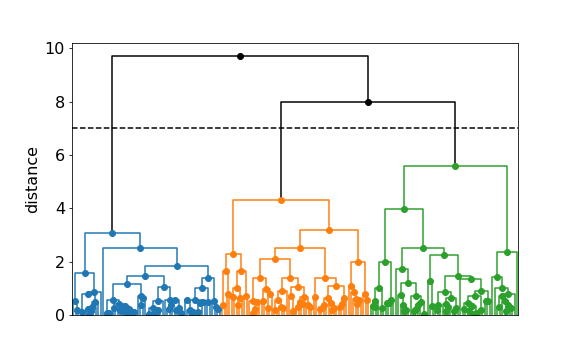
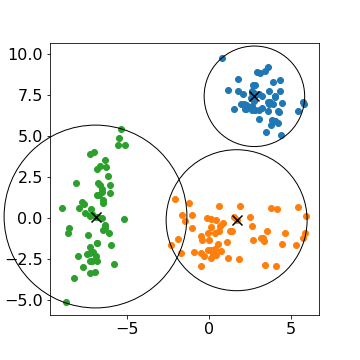

.. image:: https://readthedocs.org/projects/pyprotoclust/badge/?version=latest
   :target: https://pyprotoclust.readthedocs.io/en/latest/?badge=latest
   :alt: Documentation Status

.. image:: https://img.shields.io/badge/License-MIT-blue.svg
   :target: https://lbesson.mit-license.org/
   :alt: MIT License

**Pyprotoclust** is an implementatin of representative hierarchical clustering using minimax linkage.

The original algorithm is from
`Hierarchical Clustering With Prototypes via Minimax Linkage <https://www.ncbi.nlm.nih.gov/pmc/articles/PMC4527350/>`_
by Jacob Bien and Robert Tibshirani.

Pyprotoclust takes a distance matrix as input. It returns a linkage matrix encoding the hierachical clustering as well
as an additional list labelling the prototypes associated with each clustering. This allows a user to integrate with
the existing tools in the
`SciPy hierarchical clustering module <https://docs.scipy.org/doc/scipy/reference/cluster.hierarchy.html>`_.

Installation:

.. code-block:: python

    pip install pyprotoclust

Usage:

.. code-block:: python

    from pyprotoclust import protoclust
    import numpy as np
    import scipy as sp
    import scipy.cluster.hierarchy
    import scipy.spatial.distance

    # Generate two-dimensional toy data
    n = 60
    np.random.seed(4)
    params = [{'mean': [-7, 0], 'cov': [[1, 1], [1, 5]]},
              {'mean': [1, -1], 'cov': [[5, 0], [0, 1]]},
              {'mean': [3, 7], 'cov': [[1, 0], [0, 1]]}]
    data = np.vstack([np.random.multivariate_normal(p['mean'], p['cov'], n) for p in params])
    X = sp.spatial.distance.squareform(sp.spatial.distance.pdist(data))

    # Produce a hierarchical clustering using minimax linkage
    Z, prototypes = protoclust(X)

    # Generate clusters at a set cut_height using scipy's hierarchy module
    cut_height = 7
    T = sp.cluster.hierarchy.fcluster(Z, cut_height, criterion='distance')
    L,M = sp.cluster.hierarchy.leaders(Z, T)

    # Get the prototypes associated with the generated clusters
    P = data[prototypes[L]]

The previous example produces a linkage matrix Z and prototypes P that can be used to produce dendrograms and other
plots of the data.

    *A dendrogram of the hierarchical clustering example with a dashed line at the example cut height.*

    *A scatter plot of the example with circles centered at prototypes drawn with radii equal to the top-level
    linkage heights of each cluster.*